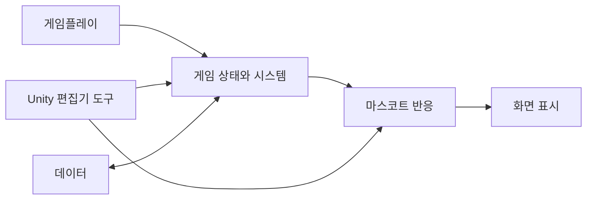
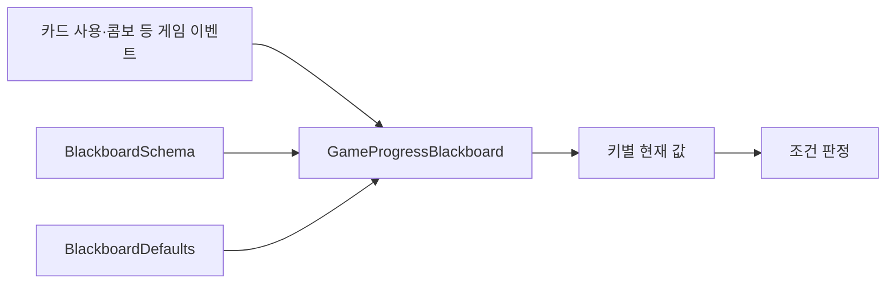
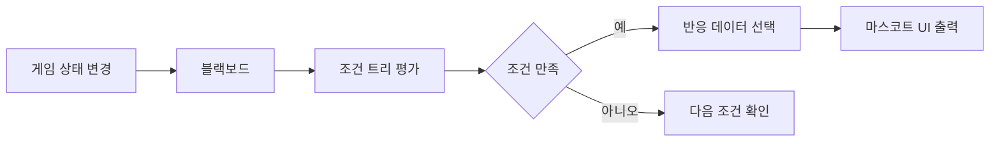
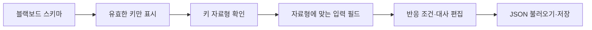
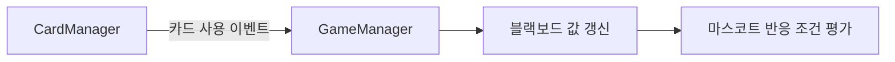

# GreenClean

2주 팀 프로젝트의 C# 코드를 포트폴리오 열람용으로 다시 분류하고, 제가 직접 구현하거나 수정한 범위를 구분해 정리합니다.

- [플레이 영상](https://youtu.be/x8sHNnBHBuU)

> `Scripts`에는 팀 코드가 함께 들어 있습니다. 파일이 존재한다는 이유만으로 파일 전체를 제 구현으로 설명하지 않습니다. 폴더 경로는 원본 Unity 프로젝트와 다를 수 있습니다.

## 전체 구조

## 코드 위치

- `Scripts/Systems/Blackboard` — 공유 상태와 조건 판정
- `Scripts/Systems/MascotReaction` — 마스코트 반응 데이터와 실행 구조
- `Scripts/Editor/Blackboard`, `Scripts/Editor/MascotReaction` — 전용 편집기 도구
- `Scripts/Gameplay` — 카드와 격자
- 그 외 `GameFlow`, `UI`, `Data`, `Audio`, `Settings`, `Common`, `Debug`

## 제가 주도적으로 구현한 부분

### 블랙보드 기반 상태 공유

키별 자료형을 스키마에 정의하고 기본값과 런타임 값을 분리했습니다. Unity 직렬화 제약 때문에 범용 `object` 대신 지원 자료형별 값을 명시적으로 보관했습니다.

관련 코드:

- `Scripts/Systems/Blackboard/GameProgressBlackboard.cs`
- `Scripts/Systems/Blackboard/BlackboardCondition.cs`
- `Scripts/Systems/Blackboard/BlackboardSchema.cs`
- `Scripts/Systems/Blackboard/BlackboardDefaults.cs`
- `Scripts/Editor/Blackboard/BlackboardSchemaEditor.cs`
- `Scripts/Editor/Blackboard/BlackboardDefaultsEditor.cs`

### 데이터 기반 마스코트 반응 시스템

값 비교, AND·OR·NOT, 항상 참, 값 변경 감지 조건을 조합할 수 있게 만들었습니다. 이후 콤보 3·5·7·10회 반응도 기존 조건 조합으로 확장했습니다.

관련 코드:

- `Scripts/Systems/MascotReaction/MascotReactionTable.cs`
- `Scripts/Systems/MascotReaction/MascotReactionTableEditor.cs`
- `Scripts/Editor/MascotReaction/MascotReactionTableEditorInspector.cs`
- `Scripts/Systems/Blackboard/BlackboardCondition.cs`

### Unity 편집기 도구

스키마에 등록된 키와 자료형을 기준으로 입력 UI를 제한하고, 반응 추가·삭제와 JSON 불러오기·저장을 지원했습니다.

## 기존 팀 코드에 수정·연동한 부분

`CardManager.cs`와 `GameManager.cs`에는 다른 팀원의 로직도 포함되어 있어, 위 연동 범위만 제 기여로 설명합니다.

## 팀원 구현으로 구분하는 부분

범용 `DataManager`와 저장 데이터 구조는 다른 팀원이 주도한 작업입니다. `Scripts/Data/Save`에 보관하지만 제 개인 기여로 설명하지 않습니다.

## 확인 가능한 커밋

- `be89d826a2176585899d2ba530fb091a0a3ffc5f` — 블랙보드 및 마스코트 반응 테이블 관리 시스템 구현
- `8085a0e842bcee4ed64089f6e4e8aa7175f6bbc4` — 반응 기능과 게임 이벤트 연동
- `352a618e167226fb235b46a291876c955b2757cf` — 콤보 반응 조건 추가 및 버그 수정

위 커밋의 GitHub 작성자는 `chaaaron000`으로 확인했습니다.

## 이 경험에서 보여주고 싶은 점

핵심은 **게임 상태와 콘텐츠 반응 규칙을 분리하고, 새로운 조건을 기존 구조의 조합으로 확장할 수 있게 만든 것**입니다. 런타임 구조와 함께 편집기 도구까지 만들어 콘텐츠 수정 시 코드 변경을 줄였습니다.

이전에 중단한 게임 모작에서 조건을 조합 가능한 데이터 노드로 표현하는 구조를 분석한 경험을 이 프로젝트의 요구에 맞게 다시 설계해 적용했습니다.
