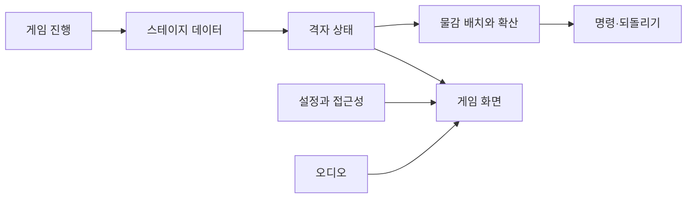
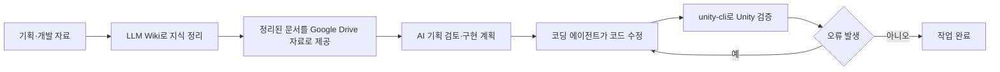
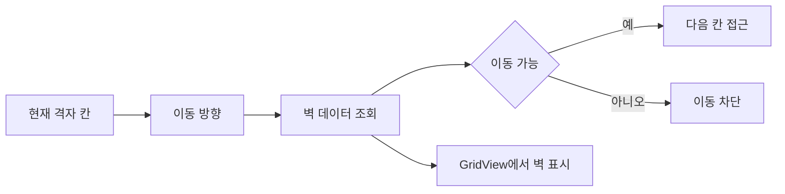
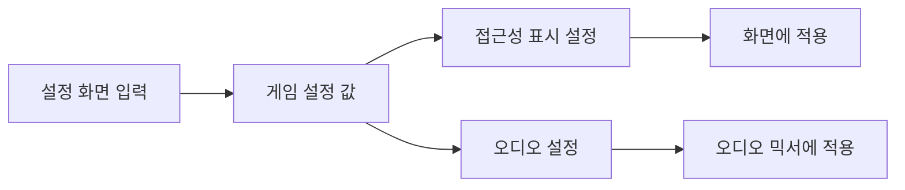
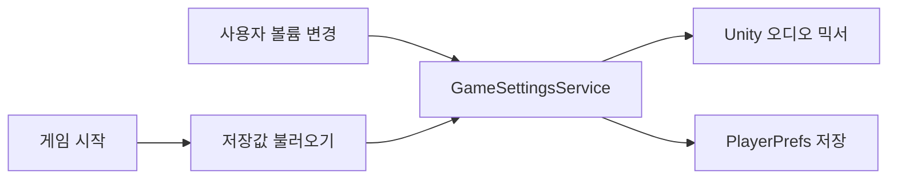

# MixterPiece

AI 활용 게임 개발 대회 출품을 목적으로 만든 논리 퍼즐 게임입니다. 팀 프로젝트의 C# 스크립트를 포트폴리오 열람용으로 다시 분류하고, 제 기여 범위를 구분해 정리합니다.

- [원본 공개 저장소](https://github.com/chaaaron000/nan2026)
- [브라우저에서 플레이](https://chaaaron000.github.io/nan2026/)

> `Scripts`의 모든 파일을 제가 작성한 것은 아닙니다. 퍼즐 핵심 알고리즘과 명령·되돌리기 구조 일부는 팀원 구현이며, 폴더 경로는 원본 Unity 프로젝트와 다를 수 있습니다.

## 전체 구조

## 코드 위치

- `Scripts/Gameplay` — 격자, 물감, 명령, 스테이지
- `Scripts/UI`, `Scripts/Settings`, `Scripts/Audio` — 사용자 설정과 표시
- `Scripts/GameFlow`, `Scripts/Editor`, `Scripts/Common` — 진행과 보조 구조
- `AI개발지침` — AI 작업 규칙과 Unity 검증 절차

## AI를 개발 과정에 활용한 방식

전체 대화와 자료를 그대로 넣는 대신 프로젝트 규칙·기획·구조를 LLM Wiki로 정리하고, 필요한 문서만 AI의 자료로 제공했습니다. `AI개발지침/AGENTS.md`에는 Unity 작업 방식, C# 변경 후 컴파일·콘솔 확인, 로그·주석 규칙 등을 저장소 수준 지침으로 고정했습니다.

핵심은 **AI에게 작업을 맡기는 것뿐 아니라, 제공할 맥락과 작업 규칙을 제한하고 실제 Unity 결과로 다시 검증하는 흐름을 만든 것**입니다.

## 직접 변경이 확인된 코드

### 격자 벽 데이터와 이동 검사

- 커밋 `00f94ec7e20ba9ca3c5517368d6adca6258f4cc8`
- `GridState`에 벽 데이터와 이동 가능 여부 검사 추가
- 방향을 좌표 변화량으로 변환하고 `GridView`의 벽 표시와 연결

관련 코드:

- `Scripts/Gameplay/Grid/GridState.cs`
- `Scripts/Gameplay/Grid/GridDirection.cs`
- `Scripts/Gameplay/Grid/GridView.cs`

`GridState` 최초 구현은 팀 코드이므로 벽 관련 변경 범위만 제 기여로 설명합니다.

### 게임 설정 화면

- 커밋 `1074c5f327f49b10629d73cc8e8661912b637bb1`
- 설정 화면과 접근성 표시 흐름 구현·연결

### 오디오 믹서와 볼륨 설정 저장

- 커밋 `05e31644d1cb55db30a80f2851df4b322d6014d2`
- 전체·배경음·효과음 볼륨을 오디오 믹서에 연결
- 첫 실행 기본값과 저장된 사용자 설정을 구분해 적용

관련 코드:

- `Scripts/Audio/SoundManager.cs`
- `Scripts/Audio/SoundLibrary.cs`
- `Scripts/Settings/GameSettingsService.cs`

위 세 커밋은 GitHub 작성자가 `chaaaron000`으로 확인됐습니다.

## 팀원 구현으로 확인된 주요 코드

- `PaintSpreadCalculator.cs`의 주요 물감 확산 탐색 — 팀원 `AripyKSU`
- `PaintBucketUseCommand.cs`와 초기 명령·되돌리기 흐름 — 팀원 `AripyKSU`
- 물감통 예약 처리와 색약 보정 재질 관련 주요 작업 — 팀원 구현

이 기능들은 전체 프로젝트 구조를 설명할 때만 사용하고 개인 기술 사례로 주장하지 않습니다.

## 이 경험에서 보여주고 싶은 점

**프로젝트 지식 정리 → 필요한 맥락 제공 → AI를 이용한 기획·구현 → Unity 검증**까지 하나의 개발 흐름으로 구성한 경험이 핵심입니다. 동시에 실제 코드 기여 범위를 따로 구분해 AI 활용과 제 엔진·코드 판단을 섞어 설명하지 않습니다.
