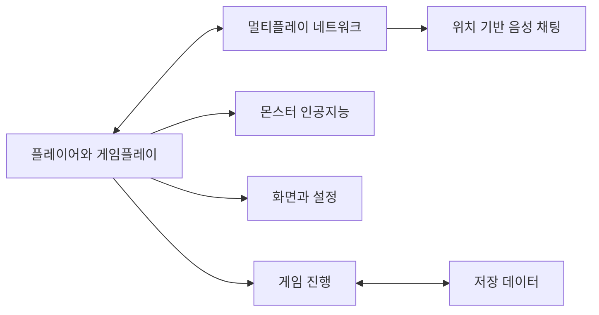
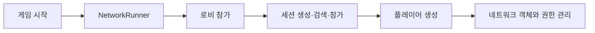
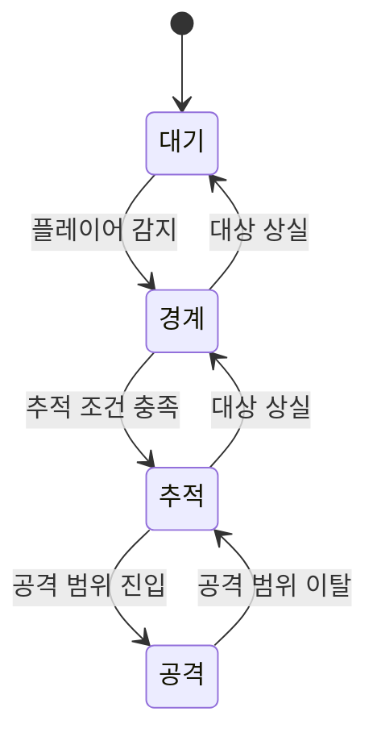
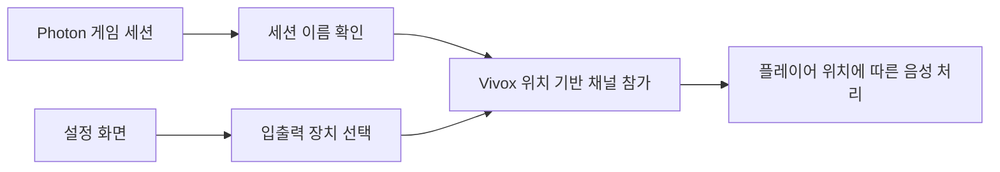

# Nostalgia

장기 팀 프로젝트의 C# 스크립트를 기능과 책임 기준으로 다시 분류해 보관하고, 그중 제가 직접 구현하거나 기존 코드를 수정한 부분을 구분해 정리합니다.

> `Scripts` 폴더에는 여러 팀원이 작성한 코드가 함께 들어 있습니다. 파일이 이 저장소에 포함되어 있다는 이유만으로 파일 전체를 제가 작성한 것은 아닙니다. 이 저장소의 폴더 구조는 포트폴리오 열람을 위해 다시 정리한 것이므로 원본 Unity 프로젝트의 경로와 다를 수 있습니다.

## 전체 구조

## 코드 폴더 구조

- `Scripts/Network/Core` — 세션, 로비, 네트워크 실행과 관리
- `Scripts/Network/VoiceChat` — Vivox 위치 기반 음성 채팅
- `Scripts/Network/CharacterSelection` — 멀티플레이 캐릭터 선택
- `Scripts/AI` — 몬스터 공통 코드와 몬스터별 상태 구조
- `Scripts/Gameplay` — 플레이어, 맵, 아이템, 추격, 튜토리얼, 싱글 플레이 등
- `Scripts/GameFlow` — 전체 게임 진행과 장면 관리
- `Scripts/UI` — 로비, 일지, 게임 오버 등 화면 구성
- `Scripts/Settings` — 그래픽·사운드·게임 설정
- `Scripts/Data/Save` — 저장 데이터
- `Scripts/Platform/Steam` — Steam 연동
- 그 외 `Audio`, `Editor`, `Common`, `Debug`

## 제가 담당한 주요 작업

### Photon Fusion 기반 멀티플레이 기능

프로젝트의 멀티플레이 구조를 다루면서 세션 생성·참가, 로비, 공유 방식 실행, 플레이어 선택과 네트워크 객체 관리 등을 작업했습니다.

관련 코드가 포함된 위치:

- `Scripts/Network/Core`
- `Scripts/Network/VoiceChat`
- `Scripts/Network/CharacterSelection`

장기간 여러 사람이 수정한 파일에는 팀 코드와 외부 예제에서 출발한 부분이 섞여 있을 수 있으므로, 해당 폴더나 파일 전체를 제 구현이라고 설명하지 않습니다. 면접과 포트폴리오에서는 제가 실제로 추가하거나 변경한 기능의 범위만 설명합니다.

### 기존 몬스터 행동 구조를 Fusion 상태 머신으로 변경

`Expressionless` 몬스터의 최초 행동 알고리즘은 제가 만든 코드가 아닙니다.

초기 구현 커밋:

- `339eb57783803693ae2cf30e2756030917093367` — `Expressionless 알고리즘 구현`
- GitHub 작성자: `AripyKSU`

이후 저는 기존 행동을 Photon Fusion의 상태 머신 구조에 맞게 나누는 작업을 했습니다.

관련 커밋:

- `fc7134720ce37d8ac652dd4e9aba5fe79d5346f0` — `FSM 테스팅 중`
- GitHub 작성자: `chaaaron000`

이 작업에서 `ExpressionlessAI`가 상태 머신을 구성하고, 대기·경계·추적·공격을 별도의 상태와 행동 코드로 분리했습니다.

관련 코드:

- `Scripts/AI/Expressionless/ExpressionlessAI.cs`
- `Scripts/AI/Expressionless/ExpressionlessIdleState.cs`
- `Scripts/AI/Expressionless/ExpressionlessAlertState.cs`
- `Scripts/AI/Expressionless/ExpressionlessChaseState.cs`
- `Scripts/AI/Expressionless/ExpressionlessAttackState.cs`
- 각 상태에 대응하는 행동 코드

Photon에서 제공하는 상태 머신 부가 기능의 원본 구현은 제 코드가 아니며, 이 저장소에서는 프로젝트가 사용한 호출·상속 코드만 보관합니다.

### Vivox 연동

게임 세션과 위치 기반 음성 채널을 연결하고, 사용자 입출력 장치 변경을 설정 화면과 연동했습니다.

확인 가능한 제 커밋 예시는 다음과 같습니다.

- `f1ceda3bc615179178f782ca39364142957764a8` — 게임 세션 이름을 이용한 Vivox 위치 기반 채널 참가 연동
- `a38e79858af69ddbf164280209e1cf73b78772e2` — Vivox 입출력 장치 변경과 설정 화면 연동

두 커밋 모두 GitHub 작성자가 `chaaaron000`으로 확인됐습니다.

## 제가 설명하지 않는 부분

초기 `Expressionless` 몬스터 알고리즘처럼 다른 팀원이 먼저 구현한 기능은 제 작업으로 주장하지 않습니다. 또한 장기 프로젝트 특성상 여러 사람이 수정한 `NetworkManager`, `VivoxManager` 등의 현재 파일 전체를 제 코드라고 표현하지 않습니다.

## 이 경험에서 보여주고 싶은 점

이 프로젝트에서 강조할 부분은 몬스터 인공지능을 처음부터 혼자 만들었다는 이야기가 아닙니다. **이미 동작하던 팀 코드를 이해한 뒤, 멀티플레이 프로젝트의 요구에 맞춰 상태와 책임을 다시 나누고 기존 기능을 새로운 구조로 옮긴 경험**이 핵심입니다.

네트워크 기술을 선택하고 세션·음성 채팅을 연결한 경험은 별도의 사례로 설명할 수 있습니다.
