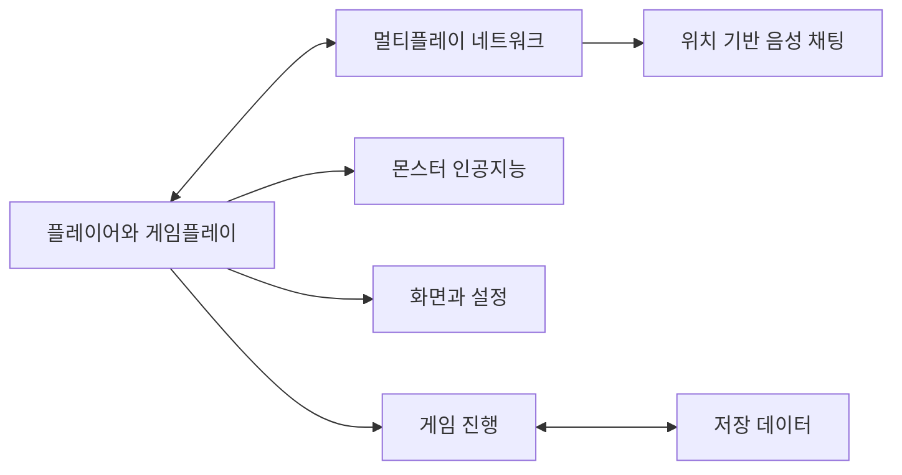
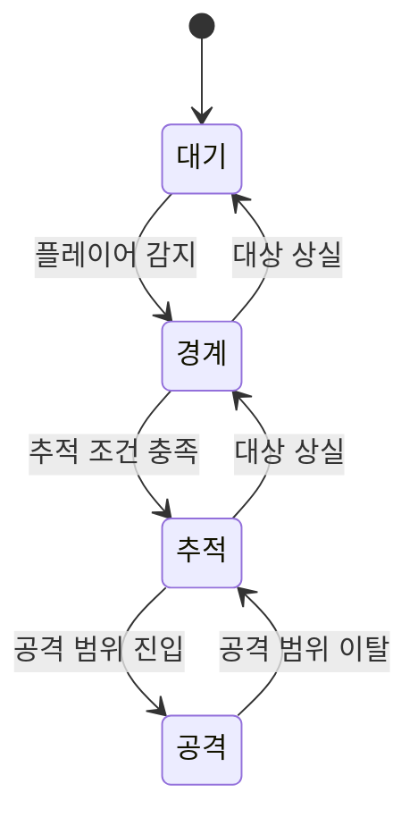
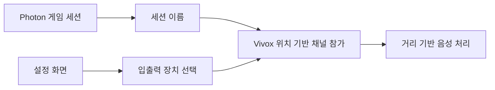

# Nostalgia

장기 팀 프로젝트의 C# 코드를 포트폴리오 열람용으로 다시 분류하고, 제가 직접 구현하거나 수정한 범위를 구분해 정리합니다.

- [Steam 페이지](https://store.steampowered.com/app/3693270/_/)

> `Scripts`에는 여러 팀원의 코드가 함께 들어 있습니다. 파일 전체가 제 구현이라는 뜻은 아니며, 폴더 경로도 원본 Unity 프로젝트와 다를 수 있습니다.

## 전체 구조

## 코드 위치

- `Scripts/Network` — 세션, 로비, 캐릭터 선택, Vivox
- `Scripts/AI` — 몬스터 공통 코드와 상태 구조
- `Scripts/Gameplay` — 플레이어, 맵, 아이템, 추격, 튜토리얼, 싱글 플레이
- 그 외 `GameFlow`, `UI`, `Settings`, `Data`, `Platform`, `Audio`, `Editor`, `Common`, `Debug`

## 제가 담당한 주요 작업

### Photon Fusion 기반 멀티플레이

관련 코드:

- `Scripts/Network/Core`
- `Scripts/Network/CharacterSelection`

장기 프로젝트 특성상 현재 파일에는 팀 코드와 외부 예제에서 출발한 부분이 섞여 있을 수 있어, 실제로 추가·수정한 범위만 제 기여로 설명합니다.

### 기존 몬스터 행동 구조를 Fusion 상태 머신으로 변경

최초 `Expressionless` 행동 알고리즘은 팀원 `AripyKSU`가 구현했습니다.

제가 담당한 것은 기존 행동을 Fusion 상태 머신 구조로 분리·이전한 작업입니다.

- 초기 구현: `339eb57783803693ae2cf30e2756030917093367` — 작성자 `AripyKSU`
- 상태 머신 리팩터링: `fc7134720ce37d8ac652dd4e9aba5fe79d5346f0` — 작성자 `chaaaron000`

관련 코드:

- `Scripts/AI/Expressionless/ExpressionlessAI.cs`
- `ExpressionlessIdleState.cs`
- `ExpressionlessAlertState.cs`
- `ExpressionlessChaseState.cs`
- `ExpressionlessAttackState.cs`

Photon이 제공하는 상태 머신 부가 기능의 원본 구현은 제 코드가 아닙니다.

### Vivox 연동

확인 가능한 제 커밋:

- `f1ceda3bc615179178f782ca39364142957764a8` — 게임 세션과 Vivox 위치 기반 채널 연동
- `a38e79858af69ddbf164280209e1cf73b78772e2` — 입출력 장치 변경과 설정 화면 연동

둘 다 GitHub 작성자가 `chaaaron000`으로 확인됐습니다.

## 제가 설명하지 않는 부분

초기 `Expressionless` 알고리즘처럼 다른 팀원이 먼저 구현한 기능이나, 여러 사람이 장기간 수정한 `NetworkManager`, `VivoxManager` 전체를 제 코드라고 표현하지 않습니다.

## 이 경험에서 보여주고 싶은 점

핵심은 **이미 동작하던 팀 코드를 이해한 뒤 멀티플레이 요구에 맞게 상태와 책임을 다시 나누고, 네트워크·음성 기능을 실제 게임 흐름에 연결한 경험**입니다.
