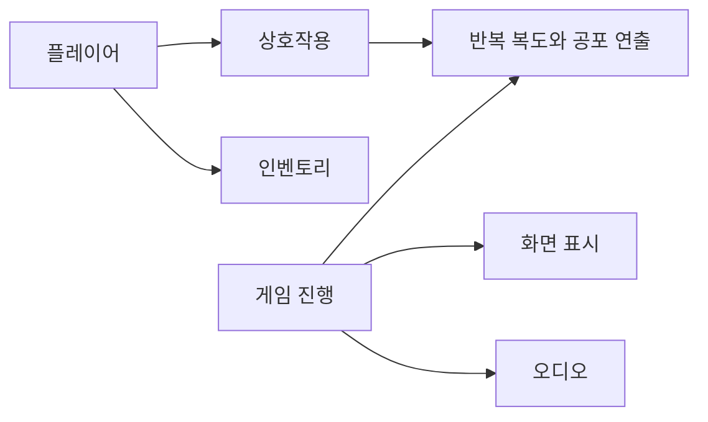
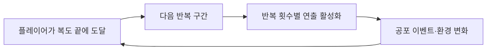
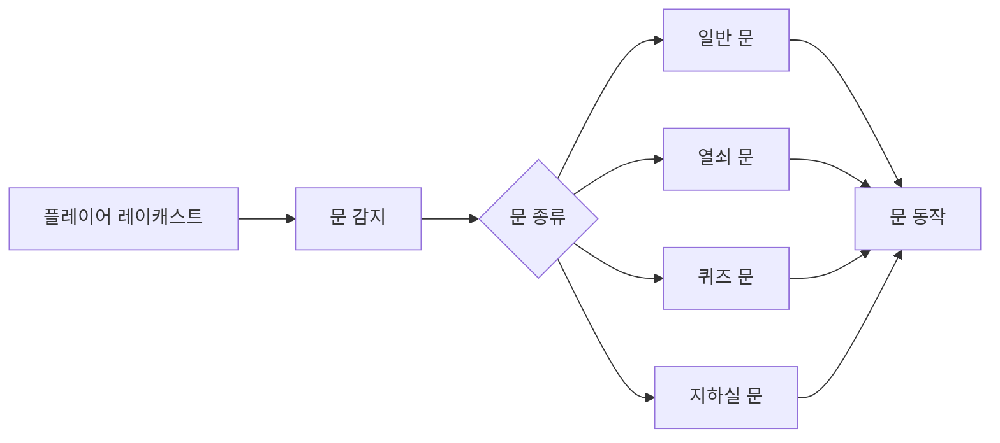

# Poltergeist

첫 Unity 팀 프로젝트의 C# 코드를 보관한 폴더입니다. 최신 기술력을 보여주는 대표작보다는 **게임 한 편을 완성하고 Git 협업을 경험한 출발점**으로 설명합니다.

> `Scripts`에는 팀 코드가 함께 들어 있습니다. 오래된 프로젝트라 작성자를 확실히 구분하기 어려운 코드는 제 기여로 설명하지 않으며, 폴더 경로는 원본 Unity 프로젝트와 다를 수 있습니다.

## 전체 구조

## 코드 위치

- `Scripts/Gameplay/InfiniteLoop` — 반복 복도와 공포 연출
- `Scripts/Gameplay/Interaction` — 문과 오브젝트 상호작용
- `Scripts/Gameplay/Player`, `Scripts/Gameplay/Inventory` — 플레이어와 아이템
- 그 외 `GameFlow`, `Audio`, `UI`, `Legacy`

## 직접 작성이 확인된 사례

### 반복 복도 제작

- 커밋 `88ab451e2ee7f3903438500bdf2a8788efc9dddd`
- 관련 코드: `Scripts/Gameplay/InfiniteLoop`

현재 파일에는 이후 팀원 수정이 섞였을 수 있어 커밋으로 확인되는 구현 범위를 우선해 설명합니다.

### 문 상호작용

- 커밋 `162293de8be0f86cbf80887b8ce4a1960c5ae53e`
- `Scripts/Gameplay/Interaction/DoorOpenClose.cs` 추가 및 플레이어 상호작용 연결
- 후속 수정 `aeebfded08143b6420b958563e929efc5257a5f2`

### 7번째 반복 구간

- 커밋 `c07178cd1e809d0b74fc187c173de442944b0b84`

위 커밋들은 GitHub 작성자가 `chaaaron000`으로 확인됐습니다.

## 팀 코드와 작성자 확인이 필요한 코드

인벤토리, 오디오, UI, 기타 상호작용 코드는 프로젝트 맥락 보존을 위해 함께 두지만 별도 커밋 확인 없이 제 구현으로 표시하지 않습니다.

## 제외한 제3자 코드

원본 프로젝트에 포함돼 있던 다음 제3자 코드는 아카이브에서 제거했습니다.

- `AtmosphericHouse/Scripts`
- `Downloaded_Assets/TutorialInfo`

## 이 경험에서 보여주고 싶은 점

**필요한 기능을 직접 붙이며 첫 게임을 완성하고 Git 협업을 배운 출발점**입니다. 이후 프로젝트에서 구조화와 개발 도구를 고민하게 된 성장 과정을 비교하는 용도로 사용합니다.
