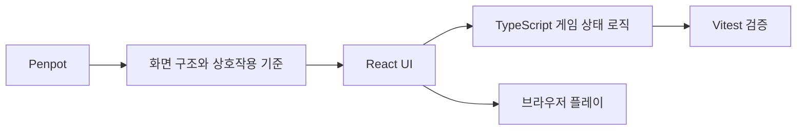
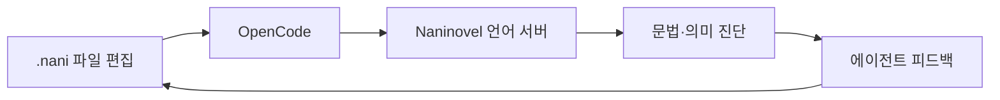
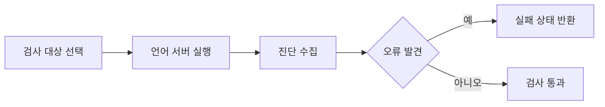
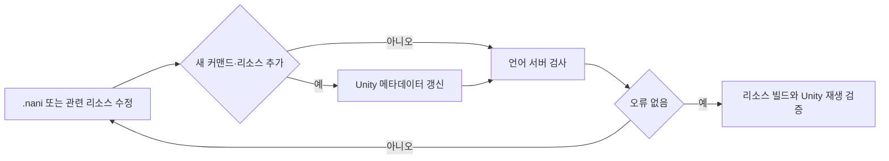

# 비주얼 노벨 개발

비주얼 노벨 프로젝트를 개발하면서 **AI가 수정한 Naninovel 스크립트를 검증하는 개발 흐름**과 **복잡한 신규 게임 시스템을 Penpot과 React로 먼저 검증하는 프로토타이핑 흐름**을 구축했습니다.

> 이 폴더에는 Naninovel의 엔진 소스, 패키지 원본, 언어 서버 바이너리·번들, 공식 확장에서 추출한 파일, 생성 메타데이터를 포함하지 않습니다. Naninovel은 유료 상용 에셋이며, 이 저장소에서는 제가 구성한 개발·검증 흐름만 설명합니다.

## 공개 프로토타입

- [React 프로토타입 원본 저장소](https://github.com/chaaaron000/beyond-the-screen-prototype)
- [브라우저에서 실행](https://chaaaron000.github.io/beyond-the-screen-prototype/)
- [Penpot 작업 화면](https://design.penpot.app/#/workspace?team-id=502b4555-3f5f-807a-8008-8a29dee3d6e7&file-id=502b4555-3f5f-807a-8008-8a2a27c83963&page-id=502b4555-3f5f-807a-8008-8a2a27c83964)

## 전체 개발 흐름

---

# Penpot + React 게임 시스템 프로토타입

## 왜 별도 프로토타입을 만들었는가

2막은 일반적인 대화 선택지 중심의 비주얼 노벨 화면과 달리, 보고서를 읽고 조사 작업을 예약하고 시간이 흐르는 동안 결과를 모은 뒤 확보한 정보를 근거로 다음 행동을 결정하는 구조입니다.

이 흐름을 Unity UI에 바로 구현하면 화면 구조와 게임 규칙을 동시에 수정해야 하므로 반복 비용이 커집니다. 그래서 먼저 **Penpot에서 화면 구성과 정보 계층을 설계하고, React로 실제 조작 가능한 수직 슬라이스를 만들어 시스템 자체를 검증**했습니다.

## 프로토타입에서 검증한 흐름

현재 공개 프로토타입은 2막 Day 1의 플레이 가능한 수직 슬라이스입니다.

프로토타입에서는 다음과 같은 요소를 실제로 조작할 수 있게 구현했습니다.

- 비주얼 노벨 장면에서 운영 보고서 화면으로 전환
- 조사 작업을 계획하고 순서를 조정
- 다음 완료 시점까지 세계 시간을 진행
- 완료된 조사 결과와 세부 자료 확인
- 확보한 정보에 따라 새로운 조사와 대사 분기 해금
- 근거를 바탕으로 현장 방문을 제안하고 결과 확인
- 보고서와 계획·결과 영역의 크기를 직접 조절하는 화면 구성

## 사용 기술

공개 프로토타입은 React와 TypeScript를 사용하고 Vite로 개발·빌드하며, Vitest를 이용해 게임 상태 로직을 검증할 수 있도록 구성했습니다.

이 프로토타입의 목적은 웹 게임 자체를 완성하는 것이 아니라, **새로운 게임 시스템을 빠르게 눈에 보이고 조작 가능한 형태로 만든 뒤 기획과 UI 흐름을 검증하는 것**이었습니다.

---

# Naninovel 스크립트 검증 자동화

## 왜 별도의 검증이 필요했는가

`.nani`는 Unity C# 컴파일만으로 유효성을 확인할 수 있는 파일이 아닙니다. AI 에이전트가 시나리오 파일을 수정한 뒤 작업 완료를 보고하더라도 잘못된 커맨드, 참조 오류, 스크립트 구조 문제 등이 남아 있을 수 있었습니다.

그래서 AI가 수정 결과를 스스로 판단하는 데서 끝내지 않고, Naninovel이 제공하는 공식 언어 서버의 진단 결과를 개발 흐름에 연결했습니다.

## 편집 중 실시간 진단

OpenCode의 사용자 정의 언어 서버 설정에 Naninovel 진단 서버를 연결해 `.nani` 파일을 열거나 수정할 때 진단 결과가 에이전트 세션으로 들어오도록 구성했습니다.

이렇게 해서 에이전트가 파일을 수정한 직후 동일한 작업 흐름 안에서 오류를 확인하고 다시 수정할 수 있게 했습니다.

## 배치 검사와 작업 실패 처리

실시간 진단과 별도로 특정 파일 또는 프로젝트 전체의 `.nani` 파일을 검사하는 배치 검사 명령을 만들었습니다. 검사 결과에 오류가 남아 있으면 정상 완료로 처리하지 않고 실패 상태로 종료하도록 구성했습니다.

의도적으로 오류가 포함된 테스트 파일과 표준 입출력 경로를 확인하는 스모크 테스트도 두어, 검사기가 실제로 오류를 잡는지 별도로 확인했습니다.

## 프로젝트 작업 규칙에 검증 절차 포함

도구를 만들어두기만 하면 AI가 검사를 생략할 수 있기 때문에 프로젝트 작업 지침에도 `.nani`를 수정한 뒤 반드시 언어 서버 검사를 통과하도록 규칙을 추가했습니다.

일반적인 `.nani` 수정은 바로 언어 서버 검사를 수행하고, 새 커맨드나 리소스를 추가해 언어 서버가 참조하는 정보가 바뀐 경우에는 Unity 쪽 메타데이터를 먼저 갱신한 뒤 검사하도록 절차를 구분했습니다.

## 확인 가능한 커밋

- `7a07a6c742e0ff44e38a2e211349ad9a1abe89eb` — Naninovel 언어 서버 검사기 추가 및 프로젝트 작업 흐름 연동
- GitHub 작성자: `chaaaron000`

이 커밋에서 배치 검사, OpenCode 언어 서버 연동, 프로젝트 작업 지침의 검증 절차가 함께 추가된 것을 확인할 수 있습니다.

## 라이선스 때문에 포함하지 않은 내용

원본 프로젝트의 Naninovel 언어 서버 도구에는 공식 VS Code 확장에서 가져온 언어 서버 번들이 로컬 의존성으로 사용됩니다. 해당 배포물의 라이선스는 `All rights reserved`로 명시되어 있으므로 이 아카이브에는 복사하지 않았습니다.

또한 다음 내용도 이 저장소에 포함하지 않습니다.

- Naninovel 엔진과 패키지 소스
- 공식 언어 서버 번들과 실행 파일
- 공식 VS Code 확장에서 추출한 파일
- Naninovel이 생성한 메타데이터와 임시 데이터
- 유료 패키지 내부 구현을 그대로 옮긴 문서나 코드

이 README는 해당 상용 도구를 재배포하거나 재현하기 위한 문서가 아니라, **기존 언어 서버를 AI 개발 흐름의 검증 단계로 연결한 경험**만 설명합니다.

## 이 경험에서 보여주고 싶은 점

이 프로젝트에서는 두 종류의 개발 문제를 별도의 도구로 해결했습니다.

- **새로운 게임 시스템의 불확실성**은 Penpot과 React 프로토타입으로 빠르게 눈에 보이는 형태로 만들어 검증했습니다.
- **AI가 생성·수정한 스크립트의 불확실성**은 언어 서버와 배치 검사로 자동 검증했습니다.

MixterPiece에서 AI의 Unity 코드 변경을 실제 엔진의 컴파일과 콘솔로 검증했다면, 이 프로젝트에서는 시스템 기획 단계의 프로토타이핑과 도메인 전용 스크립트 검증까지 개발 흐름을 확장했습니다.
