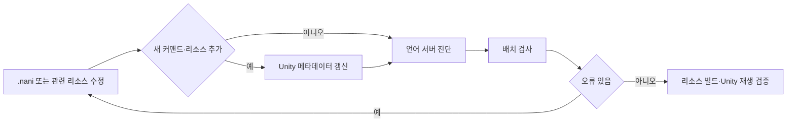

# 비주얼 노벨 개발

비주얼 노벨 프로젝트에서 **신규 게임 시스템을 빠르게 검증하는 프로토타이핑 흐름**과 **AI가 수정한 Naninovel 스크립트를 자동 검증하는 개발 흐름**을 구축했습니다.

> Naninovel은 유료 상용 에셋입니다. 이 폴더에는 엔진 소스, 패키지 원본, 언어 서버 번들, 공식 확장에서 추출한 파일, 생성 메타데이터를 포함하지 않습니다.

## 공개 프로토타입

- [React 프로토타입 원본 저장소](https://github.com/chaaaron000/beyond-the-screen-prototype)
- [브라우저에서 실행](https://chaaaron000.github.io/beyond-the-screen-prototype/)
- [Penpot 작업 화면](https://design.penpot.app/#/workspace?team-id=502b4555-3f5f-807a-8008-8a29dee3d6e7&file-id=502b4555-3f5f-807a-8008-8a2a27c83963&page-id=502b4555-3f5f-807a-8008-8a2a27c83964)

## 전체 개발 흐름

---

# Penpot + React 게임 시스템 프로토타입

2막은 보고서, 조사 계획, 시간 진행, 결과 확인, 근거 기반 행동 제안이 한 화면 흐름에 얽혀 있어 Unity UI에 바로 구현하면 기획 수정 비용이 커집니다. 그래서 화면 구조와 게임 규칙을 웹 프로토타입에서 먼저 검증했습니다.

현재 공개 프로토타입은 2막 Day 1의 플레이 가능한 수직 슬라이스이며 다음 요소를 검증합니다.

- VN 장면과 운영 보고서 화면 전환
- 조사 계획과 순서 조정
- 세계 시간 진행과 조사 결과 축적
- 확보한 정보에 따른 조사·대사 분기
- 근거 기반 현장 행동 제안과 결과 확인
- 보고서·계획·결과 영역의 크기 조절

구현은 React + TypeScript + Vite를 사용하며, Vitest로 게임 상태 로직을 검증합니다. 목적은 웹 게임 자체가 아니라 **새로운 시스템을 빠르게 조작 가능한 형태로 만들어 기획과 UI 흐름을 검증하는 것**입니다.

---

# Naninovel 스크립트 검증 자동화

`.nani`는 Unity C# 컴파일만으로 유효성을 확인할 수 없습니다. AI가 작업 완료를 보고해도 잘못된 커맨드나 참조 오류가 남을 수 있어, 공식 언어 서버 진단을 작업 완료 조건에 포함했습니다.

구성한 검증 방식:

- OpenCode에 Naninovel 언어 서버를 연결해 `.nani` 편집 중 진단을 에이전트 피드백으로 전달
- 특정 파일 또는 프로젝트 전체를 검사하는 배치 검사 제공
- 오류가 남으면 성공으로 종료하지 않고 실패 상태 반환
- 의도적 오류 파일과 표준 입출력 스모크 테스트로 검사기 자체 동작 확인
- 프로젝트 작업 지침에 검사 통과를 필수 단계로 명시

확인 가능한 커밋:

- `7a07a6c742e0ff44e38a2e211349ad9a1abe89eb` — Naninovel 언어 서버 검사기 추가 및 프로젝트 작업 흐름 연동
- GitHub 작성자: `chaaaron000`

## 라이선스 때문에 포함하지 않은 내용

원본 프로젝트는 공식 VS Code 확장에서 가져온 언어 서버 번들을 로컬 의존성으로 사용하며, 해당 배포물은 `All rights reserved`로 명시되어 있습니다. 따라서 이 아카이브에는 다음 내용을 복사하지 않았습니다.

- Naninovel 엔진과 패키지 소스
- 공식 언어 서버 번들과 실행 파일
- 공식 VS Code 확장에서 추출한 파일
- Naninovel 생성 메타데이터와 임시 데이터
- 유료 패키지 내부 구현을 그대로 옮긴 문서나 코드

## 이 경험에서 보여주고 싶은 점

- **게임 시스템의 불확실성**은 Penpot + React 프로토타입으로 빠르게 검증했습니다.
- **AI가 수정한 스크립트의 불확실성**은 언어 서버와 배치 검사로 자동 검증했습니다.

즉 구현에 들어가기 전의 시스템 검증과, AI 작업 이후의 결과 검증을 각각 별도 도구로 해결한 경험입니다.
